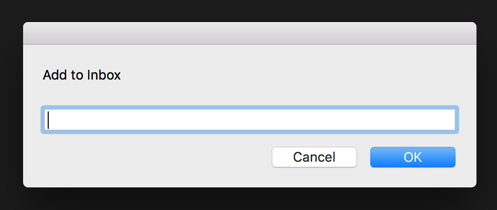

# QuickDynalist for Mac

Service for MacOS to add items to your Dynalist.

This repository contains two services
1. `Add to Dynalist` pastes the current selection into Dynalist
2. `QuickDynalist` opens a text box to enter text



## Install

Put your API key (from [https://dynalist.io/developer](https://dynalist.io/developer)) into your `.bashrc` file, e.g. using
```bash
echo "export DYNALIST_TOKEN='MY_KEY'" >> ~/.bashrc
```

Put the workflow files in `~/Library/Services`, e.g. using
```bash
mv 'Add to Dynalist.workflow' QuickDynalist.workflow ~/Library/Services
```

## Usage

After selecting any text you can find `Add to Dynalist` in the context menu `Services > Add to Dynalist` (or setup a keyboard shortcut below).
For the popup box a keyboard shortcut is required.

## Setup keyboard shortcuts

Go to `Systems Preferences > Shortcuts > Services` and

1. set your favourite shortcut for `Add to Dynalist` to directly paste your selection into Dynalist
2. set a shortcut for the `QuickDynalist` popup
